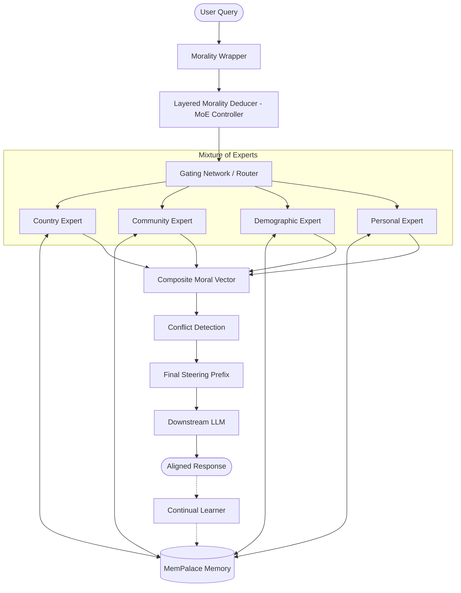
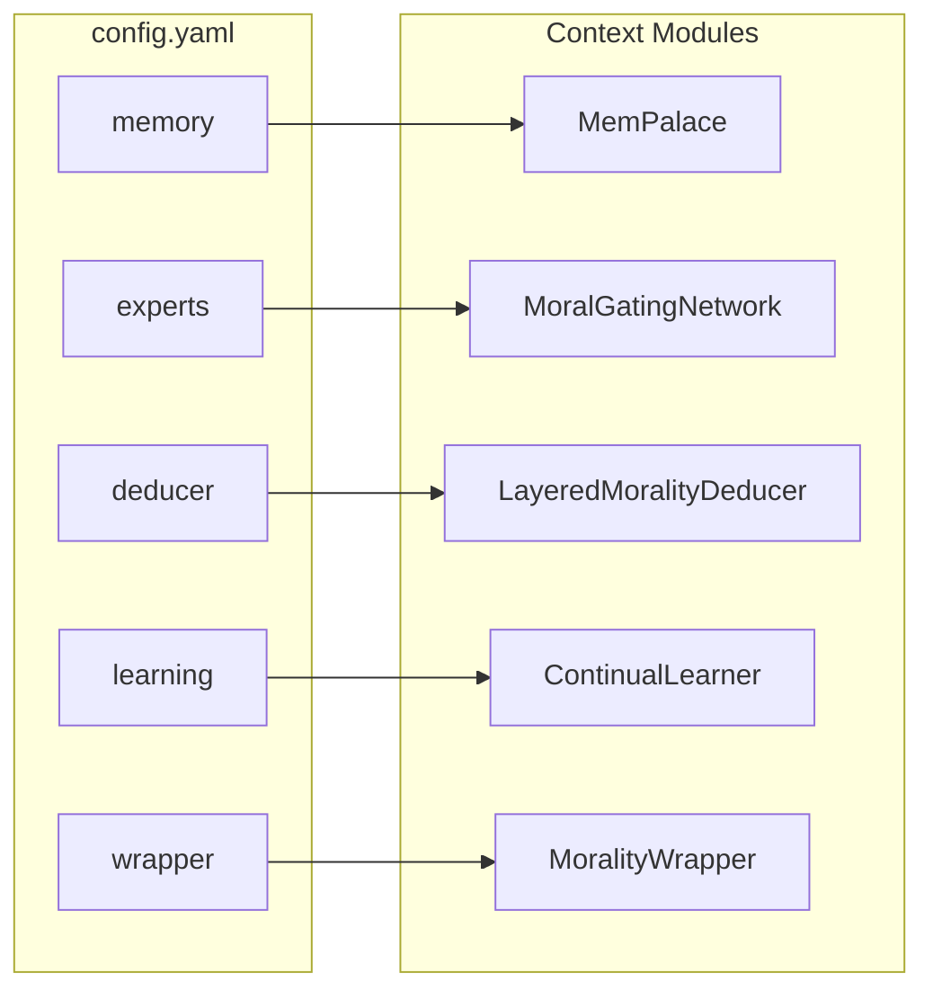
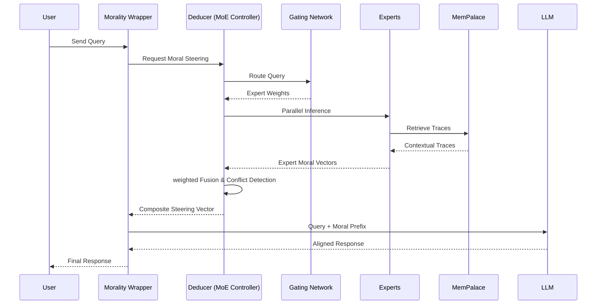

# OpenDike: Layered Morality Deducer

OpenDike is a lightweight morality wrapper and gateway designed to sit in front of downstream LLMs. It uses a hierarchical moral reasoning system to generate composite steering vectors based on cultural, community, demographic, and personal layers.

## Problem it tries to solve: Alignment & value learning

### Why it matters: existential + societal risk

### How do we ensure AI systems behave according to human values?

### What’s unsolved
	•	Defining “human values” computationally
	•	Preventing unintended harmful behaviors
	•	Scaling alignment to superhuman systems  

### Human impact
	•	Safe deployment in healthcare, military, governance
	•	Preventing large-scale misuse or accidents


## Architecture & Workflow

### System Architecture


### Config-Context Association


### Request Sequence


## Project Structure

- `src/opendike/`: Core logic and models.
    - `models.py`: Pydantic models for `MoralVector` and `MoralTrace`.
    - `memory.py`: `MemPalace` hierarchical memory implementation.
    - `experts.py`: MoE Experts and Gating Network.
    - `deducer.py`: `LayeredMoralityDeducer` controller.
    - `wrapper.py`: `MoralityWrapper` gateway.
    - `learning.py`: `ContinualLearner` loop.
    - `core.py`: Example entry point.
    - `train.py`: Training stubs for future improvements.
- `data/`: Local storage for `MemPalace` traces and profiles.
- `tests/`: Unit and integration tests.
- `requirements.txt`: Python dependencies.
- `Dockerfile` & `docker-compose.yml`: Containerized runtime and training setup.

## Setup & Usage

### Local Installation

1. Install dependencies:
   ```bash
   pip install -r requirements.txt
   ```
2. Run the core example:
   ```bash
   export PYTHONPATH=$PYTHONPATH:$(pwd)/src
   python src/opendike/core.py
   ```

### Docker Setup

Run the runtime service:
```bash
docker-compose up runtime
```

Run the training service (stub):
```bash
docker-compose up training
```

## Core Features

- **Mixture of Experts (MoE) Architecture**: Decouples layer logic into specialized experts coordinated by a gating network.
- **Hierarchical Reasoning**: Composes moral priorities from Country, Community, Demographic, and Personal layers.
- **MemPalace Memory**: Spatial/hierarchical storage for morally salient interaction traces.
- **Continual Learning**: Updates experts (specifically Personal) based on user feedback and moral episodes.
- **Conflict Detection**: Identifies and reports moral disagreements between different experts.

## Real World Use Cases

OpenDike's hierarchical architecture enables nuanced AI alignment across diverse domains:

### 1. Dynamic Parental & Educational Controls
*   **The Scenario**: An AI tutor or companion for a child that matures alongside them.
*   **Layer Interaction**:
    *   **Demographic Layer**: Set to "Child" (ages 5-10), emphasizing high *Care* and *Authority* (safety/guidance).
    *   **Community Layer**: Reflects school or family values (e.g., focus on *Fairness* and *Curiosity*).
    *   **Personal Layer**: Learns the child's specific struggles and interests.
*   **Evolution**: As the child enters the "Teenager" demographic, the system automatically shifts weights—reducing *Authority* dominance in favor of *Liberty* and *Care*, encouraging critical thinking while maintaining core safety floors.

### 2. Global Enterprise & Regional Compliance
*   **The Scenario**: A multinational corporation deploying a single AI helpdesk across 50 countries.
*   **Layer Interaction**:
    *   **Country Layer**: Encodes local legal requirements (e.g., GDPR in the EU, specific labor laws in France, or cultural speech norms in Japan).
    *   **Community Layer**: Standardizes corporate "Code of Ethics" across all branches.
    *   **Personal Layer**: Adapts to the specific department (Legal vs. Creative) to adjust technical vs. empathetic tone.
*   **Benefit**: Eliminates the need for 50 different fine-tuned models; one model is steered dynamically by the local Country layer.

### 3. Healthcare & Cultural Competency
*   **The Scenario**: An AI medical assistant providing health advice to diverse populations.
*   **Layer Interaction**:
    *   **Country Layer**: National health guidelines and bioethics standards.
    *   **Community Layer**: Respects cultural or religious views on specific medical practices (e.g., dietary restrictions, end-of-life care preferences).
    *   **Personal Layer**: Learns the individual patient's history of medical mistrust or specific health goals.
*   **Benefit**: Ensures medical advice is not only scientifically accurate but culturally resonant, increasing patient adherence and trust.

### 4. Conflict Resolution & Mediation
*   **The Scenario**: An AI-facilitated platform for resolving disputes between parties with different values.
*   **Layer Interaction**:
    *   **Conflict Detection**: The Deducer explicitly flags when a proposed solution violates a Country-level *Authority* norm for one party but matches a Personal-level *Fairness* preference for another.
    *   **Transparency**: The system generates a "Moral Map" showing where the parties align and where their hierarchical layers diverge.
*   **Benefit**: Provides a neutral, transparent framework for understanding the *root* of value-based conflicts rather than just the surface-level disagreement.

### 5. Personalized Ethical AI (The "Digital Twin")
*   **The Scenario**: A personal AI agent that reflects the user's specific moral philosophy (e.g., Utilitarianism, Stoicism, or specific religious tenets).
*   **Layer Interaction**:
    *   **Personal Layer**: The user provides explicit feedback ("In this dilemma, I value Loyalty over Fairness"). The **Continual Learner** updates the Personal Layer embeddings.
    *   **Trace Retrieval**: When the user asks a sensitive question, the "Palace Walk" retrieves past interactions where the user expressed these specific values.
*   **Benefit**: The AI becomes a true extension of the user's agency, providing advice and drafting content that is "authentically them."

## Suggested Features & Roadmap

### Short Term (v0.2 - v0.5)
- **Production Vector DB Integration**: Transition from simple dict-based storage to `ChromaDB` or `FAISS` for high-performance retrieval.
- **Expanded MFT Dimensions**: Add more granular dimensions like *Liberty/Oppression* and *Wastefulness/Efficiency*.
- **API Gateway Interface**: Wrap the Deducer in a FastAPI service for seamless integration with existing LLM pipelines.

### Mid Term (v0.6 - v1.0)
- **Nuanced Moral Deduction (Transformer)**: Replace heuristic trace-influence with a small fine-tuned transformer (e.g., a 125M parameter model) to better capture the relationship between context and moral weights.
- **LoRA Adapter Support**: Implement Low-Rank Adaptation (LoRA) for efficient per-layer updates without full model fine-tuning.
- **Transparency Dashboard**: A UI to visualize the "Palace Walk" and how different layers contributed to a specific response.

### Long Term (v1.5+)
- **Distributed/Federated Memory**: Implement a cloud/edge hybrid where broad layers (Country/Community) are updated via federated learning, while Personal layers remain strictly local for privacy.
- **Cross-Layer Reasoning**: Enable the Deducer to reason about *why* layers conflict and propose synthetic compromises.

## Scaling

- **Horizontal Scaling**: Deploy multiple Deducer instances behind a load balancer; broad layers are cached, personal layers are fetched per-session.
- **Privacy-First Storage**: Personal layers can be stored on-device (Edge AI) with only the resulting steering vectors sent to the cloud.
